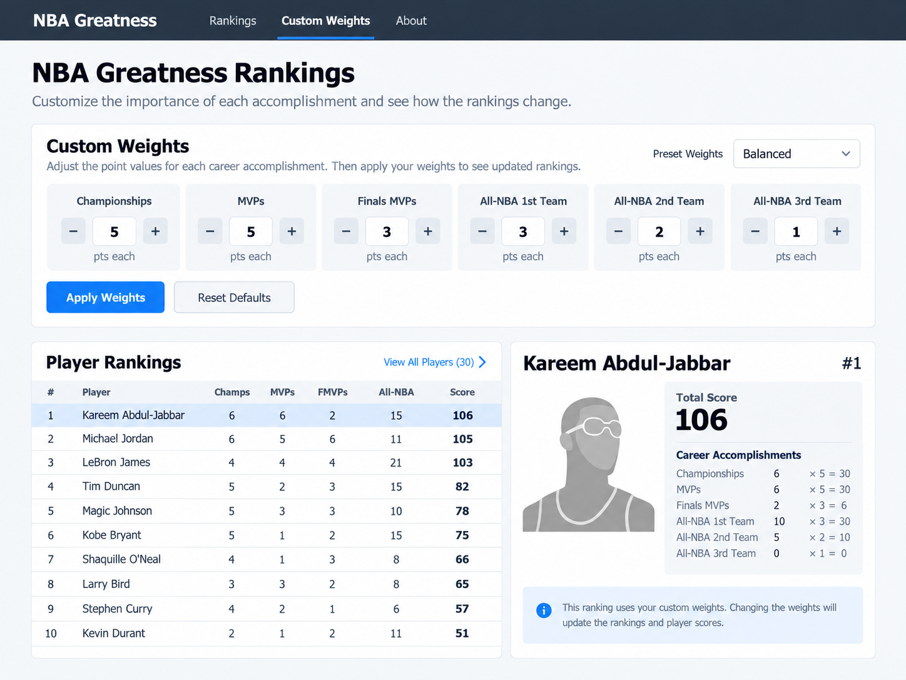
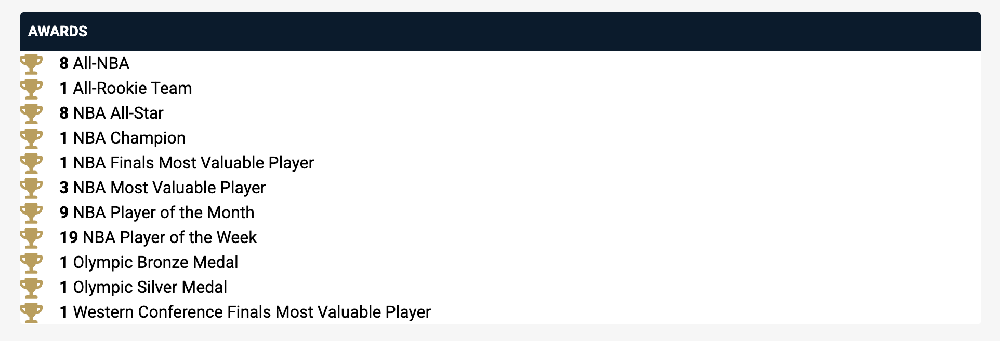
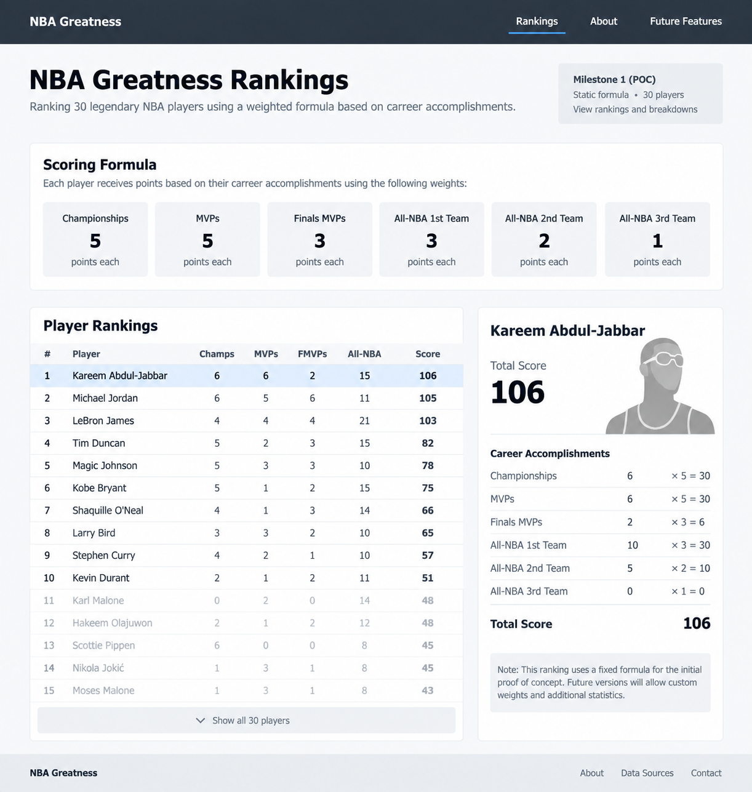
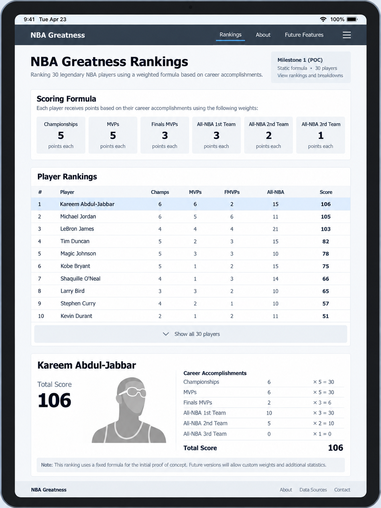
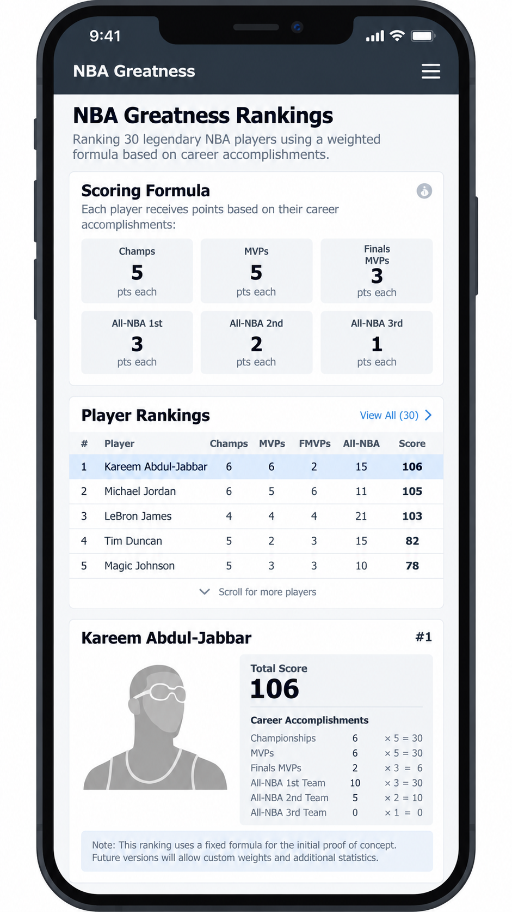
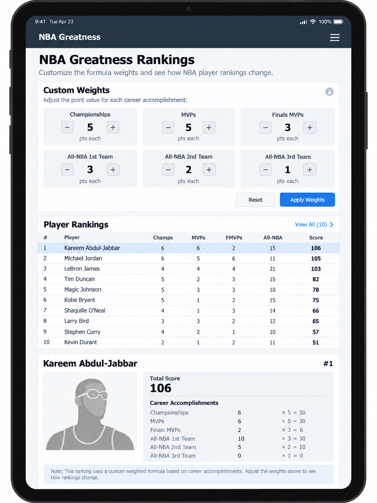
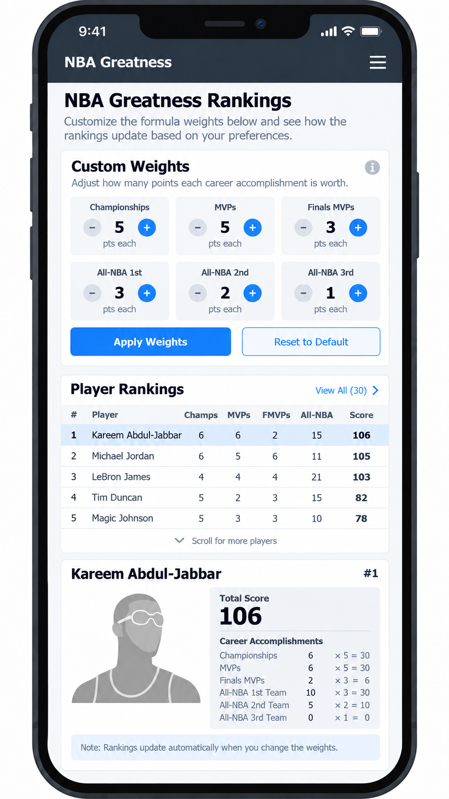
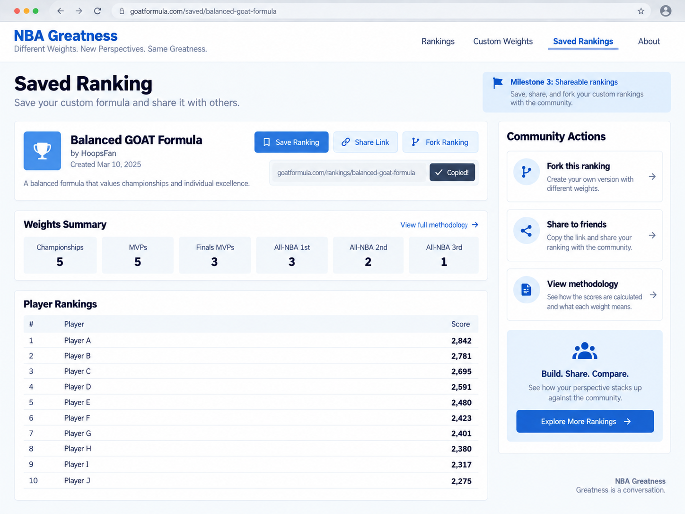
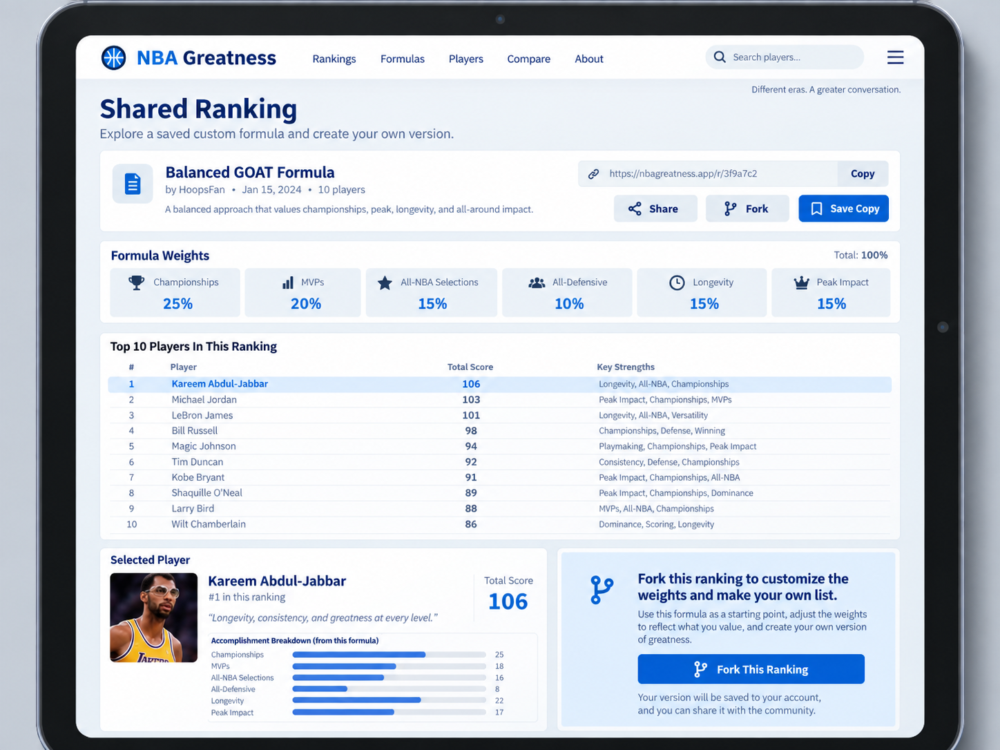
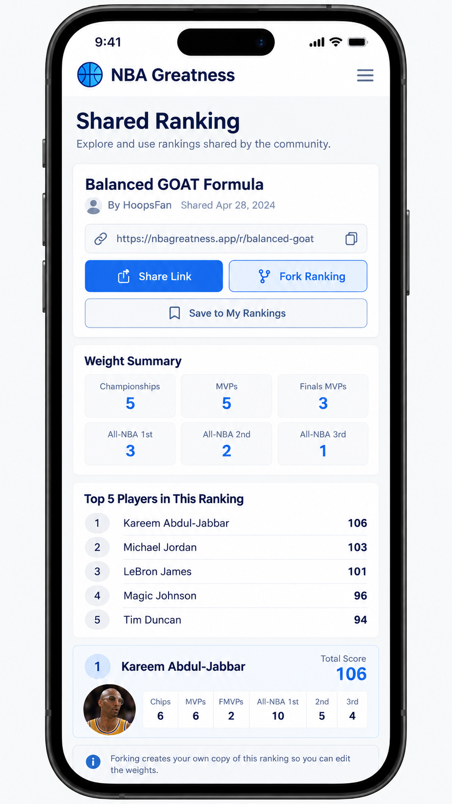

# Overview

## Metadata

- Status: Draft
- Created: September 2026
- Purpose: High-level vision and architecture design

## Objective

Build a web application that lets basketball fans create, explore, and share rankings of the greatest modern-era NBA players.

Instead of presenting a single "correct" ranking, the user can decide how much each accomplishment matters. 

The app then applies those weights consistently across eligible players.



## Background

Debating the greatest NBA players is part of basketball culture. 

Ask a fan for their top ten list and familiar questions quickly appear:
- Who is number one: Michael Jordan or LeBron James?
- Who ranks higher: Magic Johnson or Larry Bird?
- How much do championships matter compared with individual awards?

Most published rankings ultimately reflect the author's hidden preferences. 

Some systems, such as John Hollinger's GOAT Points, make those preferences more explicit by assigning points to career achievements, but the reader still has to accept the author's formula.

This app makes the formula interactive. It helps a user answer:

*Given the accomplishments I value, how would NBA players rank?* 

## Goals

- A new user can understand the premise without additional explanation
- A user can create a ranking that reflects their stated preferences
- A viewer can explain why one player ranks above another
- Two people using the same dataset and weights receive the same result
- The initial scope is small enough to implement as a learning project
- The results are intended to be a fun conversation starter

# Scope

## Player Pool

The app focuses on the modern NBA era, beginning with the 1979–80 season. 

This boundary roughly aligns with the introduction of the three-point line and the start of the Magic Johnson/Larry Bird era.

This limits the scope of the app and makes getting the data easier

It also avoids some of the issues of comparing different eras
- Ex: The NBA consisted of 8 teams from 1956 to 1961, 14 in 1969, etc
- https://en.wikipedia.org/wiki/Expansion_of_the_NBA

## Accomplishments

The initial ranking formula uses the following countable accomplishments:
- NBA championship
- NBA Most Valuable Player (MVP)
- NBA Finals MVP
- NBA Defensive Player of the Year (DPOY)
- All-NBA First Team
- All-NBA Second Team
- All-NBA Third Team
- All-Defensive teams
- NBA Finals appearance
- NBA Rookie of the Year

Later iterations might include the following:
- Career Totals (Points, Rebounds, Assists, etc)
- Career Averages (PPG, RPG, APG, etc)
- All-Star selections (maybe, but mostly popularity based)
- Statistical milestones, such as triple-doubles
- Leading the league (ex: Scoring titles)

One reason for deferring averages is because they use different scales and require normalization to account for pace and era.

## Ranking Model

Each accomplishment type has a (non-negative) numeric weight chosen by the ranking's creator. A player's score is the sum of their accomplishment counts multiplied by those weights.

```text
player score = Σ (accomplishment count × accomplishment weight)
```

For example, if an MVP is worth 10 points and a championship is worth 8 points, a player with two MVPs and three championships receives 44 points from those two categories.

The UI should show both the total score and its breakdown so that viewers can understand the result. A weight of zero means an accomplishment does not affect that ranking.

Players with the same score share the same rank. They are displayed alphabetically within the tie.

Some accomplishments overlap by design. A DPOY winner will often also receive an All-Defensive selection, just as an MVP winner will often receive an All-NBA selection. The model treats these as separate accomplishments because they represent different honors, but the default weights should account for the overlap so that related achievements are not unintentionally overemphasized.

##  Questions

- What are good default weights for the different achievements?
- How do we handle awards that did not exist in previous eras?
- Do eligible player’s pre-1980 accomplishments count (ex: Kareem’s earlier awards)
- How can values with different scales be normalized 
- How do we keep the formulas fun without making it hard to understand them
- How do we handle ongoing data ingestions, and how often?
- How do we handle data corrections, are old rankings immutable?

# Scenarios

There are two main scenarios that users of the app can take.

## 1. View a Ranking

 Someone has shared a link with me, I can:
- See the ranking's title, description, and ordered player list
- See the formula and weights used to produce it
- Inspect a player's score breakdown
- See which dataset version the ranking used
- Start a new ranking by copying the shared formula
- No account is required to view a public ranking

## 2. Create a Ranking

I can create a new ranking
- I can start with the default formula or copy an existing ranking
- Change the weight assigned to each supported accomplishment
- Apply the changes and see the ranking recalculate immediately
- Add a title and optional description
- Save the ranking and receive a shareable link

# Architecture

## Data Model

We can use a relation database — ex: Postgres
- https://www.postgresql.org

Players and accomplishment types should be modeled separately 
- We should avoid using a column per achievement 
- Adding a new accomplishment should not require a schema change

```
players
-------
id
name
championships ❌
mvps ❌
finals_mvps ❌
all_nba_first ❌
...
```

## Tables

`players` — contains player information (id, name, etc)

```
players
-------
id
name
external_id
```


`accomplishment_types` — contains the different accomplishments (ex: MVP)

```
accomplishment_types
-------
id 
code
name
description
```


`player_accomplishments` — is a joining table

```
player_accomplishments
-------
id 
player_id 
accomplishment_type_id 
season 
team
```


A persisted ranking is conceptually a snapshot containing:
- The important part is that a shared ranking retains the formula and dataset version used

```
ranking
-------
id
title
description
weights
dataset_version
created_at
```

## Sample Data

Initial accomplishment data:

| Code                | Name                         |
| ------------------- | ---------------------------- |
| `championship`      | NBA Championship             |
| `mvp`               | Most Valuable Player         |
| `finals_mvp`        | Finals MVP                   |
| `dpoy`              | Defensive Player of the Year |
| `all_nba_first`     | All-NBA First Team           |
| `all_nba_second`    | All-NBA Second Team          |
| `all_nba_third`     | All-NBA Third Team           |
| `all_defensive_first`  | All-Defensive First Team  |
| `all_defensive_second` | All-Defensive Second Team |
| `finals_appearance` | NBA Finals Appearance        |
| `roy`               | Rookie of the Year           |
|                     |                              |

Example for Jordan:

| player_id | accomplishment_type_id | season |
| --------- | ---------------------- | ------ |
| 23        | 2 (mvp)                | 1991   |
| 23        | 1 (championship)       | 1991   |
| 23        | 3 (finals_mvp)         | 1991   |
| 23        | 2 (mvp)                | 1992   |

## Data Ingestion

One of the biggest questions is where should we source our data from.

There are few high quality sources, see notes below
- Basketball Reference & NBA API (with several wrappers)

We can query an external API in realtime, however a better option is to ingest the data
- The data rarely changes, we can store it in our own relational database (Postgres)
- We don't want to be rate limited 
- Or break if the external API changes

```
Data Source -> ingestion script -> Database -> API -> UI
```

The ingestion process should:
1. Fetch or parse records from the selected source
2. Map external players and awards to canonical application records
3. Validate duplicates, missing seasons, and unexpected values 
4. Produce a versioned dataset that can be reviewed before publication
5. Record source and import metadata so incorrect records can be traced and corrected

Automated ingestion is useful, but a small curated dataset is acceptable for the first prototype. 

## NBA API

The official NBA API available at `stats.nba.com`
- The HTML pages seem to load fine, I get timeouts when using  `requests` or `fetch` 
- It's possible NBA.com allows calls from their own frontend, but blocks others...
- https://www.nba.com/stats/players/traditional
- https://www.nba.com/stats/player/203999/career — HTML page for Jokic
- https://stats.nba.com/stats/playerawards?PlayerID=203999 — Call for Jokic, times out



`nba_api` — A Python client for accessing NBA.com
- https://github.com/swar/nba_api

`nba-api` — A Python client for accessing NBA.com
- https://nba-apidocumentation.knowledgeowl.com
- https://nba-apidocumentation.knowledgeowl.com/help/playerawards

## Basketball Reference

The following URLs from Basketball Reference contain data that can be parsed if necessary.

Some Basketball Reference awards pages combine NBA and ABA records. The app should ingest NBA records only; ABA accomplishments are outside the initial scope.

(1) Championships (Count by Player)
https://www.basketball-reference.com/leaders/most_championships.html

(2) MVP Award (by year)
https://www.basketball-reference.com/awards/mvp.html

(3) Defensive Player (by year)
https://www.basketball-reference.com/awards/dpoy.html

(4) All-NBA selections by player (1st, 2nd, 3rd team)
https://www.basketball-reference.com/awards/all_league_by_player.html

(5) All-NBA selection by year
https://www.basketball-reference.com/awards/all_league.html

(6) Rookie of the Year, All Rookie Teams
https://www.basketball-reference.com/awards/roy.html
https://www.basketball-reference.com/awards/all_rookie.html

(7) All-Defensive selections by player
https://www.basketball-reference.com/awards/all_defense_by_player.html

(8) All-Defensive teams by season
https://www.basketball-reference.com/awards/all_defense.html

Finals Appearances (By Team)
- https://www.basketball-reference.com/playoffs
- https://www.basketball-reference.com/playoffs/series.html
- https://www.basketball-reference.com/playoffs/2026-nba-finals-knicks-vs-spurs.html
- Note: Player final appearance might need to be derived

Awards Index
https://www.basketball-reference.com/awards

NBA 75th Anniversary Team
- https://www.basketball-reference.com/awards/nba_75th_anniversary.html


## Web Stack

**Milestone 1**
- Can be a simple React application with no backend
- Data can come from a simple `.json` and be limited to ~30 players
- The objective is to validate if the default ranking is fun or has any glaring problems 

```
nba-rankings/
	src/ 
		components/ 
	data/ 
		players.json 
	lib/ 
		scoring.ts 
		App.tsx 
	public/
	
	package.json
```

**Milestone 2**
- We need to ingest external data into our own database
- The ingestion script can be a Node or Python script
- The web app can use React + Node + Postgres (Drizzle ORM)
- We can structure the project as a monorepo

```
nba-rankings/
  apps/
    web/       — React (Vite)
    api/       — Express 
  packages/
    shared/   - shared TS types/schemas

  ingestion/  — Node or Python
    scripts/

  package.json
  pnpm-workspace.yaml
```

Images — Let's keep it simple and include images inside the web app
- We won't have enough images to need external storage (ex: S3 object storage)
- We can start with a generic image for all players, ex: `default-player.png`
- Then add more images, ex: `LebronJames.png`, `NikolaJokic` 
- Or we can name the images after IDs, ex: `203999.png`
- ex: https://cdn.nba.com/headshots/nba/latest/1040x760/203999.png — Jokic
- In either case we should host them and not rely on external resources

Deferred Decisions — we can decide this later
- Plain CSS vs Tailwind
- UI/UX System, ex: Material
- Component Library: Shadcn, Radix, etc

# Project Milestones

## Milestone 1) Fixed Ranking

Goal: Validate the presentation & explainability of a weighted ranking
- Use predetermined fixed weights 
- Use a curated dataset of  ~30 notable players
- Show the ranked list on page load
- Show an individual player's score breakdown

Technical Notes
- Can be a React application or server side web app
- The data can come from a hardcoded `data.json` file
- No database, accounts, ingestion automation, or durable sharing

Success
- A reviewer can understand the formula and explain why one player ranks above another. 
- Validate the sample data and default weights have no obvious errors 

## Milestone 2) Custom Weights

Goal: Validate the interaction of creating a personal formula.
- Show the current weight for every supported accomplishment
- Allow weights to be increased, decreased, or set to zero
- Recalculate and reorder the ranking after changes are applied
- Keep the curated local dataset and client-only architecture

Success 
- A user can change the formula
- See a predictable change in the rankings
- Understand why the result changed

## Milestone 3) Save & Share

Goal: Allow Saving & Sharing Ranking
- Store players, accomplishments, dataset versions, and saved rankings
- Save configuration (weights, results) & metadata (title, description), immutable?
- View and share using URLs, ex: `site.com/ranking/<UUID>`
- Ability to fork a shared URL

Technical Notes
- Ingest and validate a broader modern-era dataset
- Player images can be packaged and hosted with the web app. 

# Screens

The core page contains:
- Navigation and a brief explanation of the ranking
- The scoring formula
- The ranked player list
- A selected player's score breakdown
- A footer with methodology and source links

We likely need the following UI components
- Navigation
- Header
- ScoringFormula
- PlayerRankings
- PlayerCard
- Footer

## Milestone 1 Screens

Description 
- The left side is the ranked player table
- Clicking a player row selects that player
- The selected row gets a highlight so it’s clear which player is active
- The right-hand panel updates to show that player's score breakdown
- "Show all 30 players" expands the table
- The navigation links just show static pages
- The formula cards are display-only for now
- The ranking itself is static, no filtering, sorting, or weight adjustment
- Default to the first row when the page loads

Desktop



Tablet



Mobile




## Milestone 2 Screens


Description
- The user sees the current weights and then current ranking below
- Accomplishments have a minus + plus button and display the current value
- The user can Apply Weights after making edits

Applying Weights
- Tap `+` / `-` to change the value
- Optionally support direct numeric input too, ex: `5`
- Clicking "Apply Weights" recalculates scores & re-sorts the ranking
- Update the selected player card to the first row after re-sorting
- When the weights are in pristine state, disable the Apply Weights button
- When the weights have been edited, enable the Apply Weights button

Desktop
- On desktop/tablet, the user sees the current weights first
- Then rankings are displayed in a table below the weights
- The player detail view sits to the right of the table


Tablet
- The player detail view stacks below the rankings
- When a player is tapped
	- Scroll smoothly to the detail card
	- Or open the details as an expandable row/card directly underneath
	- Otherwise the interaction might be hidden below the fold
	- Preference for the expandable interaction



Mobile




## Milestone 3 Screens

Milestone 3 adds: 
- A title and description
- save/share action
- stable ranking URL
- The ability to copy or fork


Desktop



Tablet



Mobile




# Appendix

## Routes

Milestone 1
- `/` — home page, shows static page
- `/about` — information about the project

Milestone 3
- `/rankings/<uuid>` — saved ranking, shareable URL

Future Ideas
- `/players/<slug>` — possible future player profile

## Domain Names

Let's avoid using NBA in the name, some ideas:
- `hoopsrank.com`
- `hooprankings.com`
- `ringstomvps.com`
- `hoopsformula.com`
- `hoopscore.com`
- `mygoatformula.com`
- `rankthegreats.com`
- `buildyourgoat.com`

## Docs

ChatGPT Session
https://chatgpt.com/c/6aa5b0b5-a2b0-83ea-9e8c-992de03ba85b

How to Write an Effective Software Design Document
https://refactoringenglish.com/excerpts/write-an-effective-design-doc

The Basketball 100 (GOAT Points), John Hollinger
https://www.nytimes.com/athletic/5940794/2024/11/26/the-basketball-100-goat-points-book-excerpt
